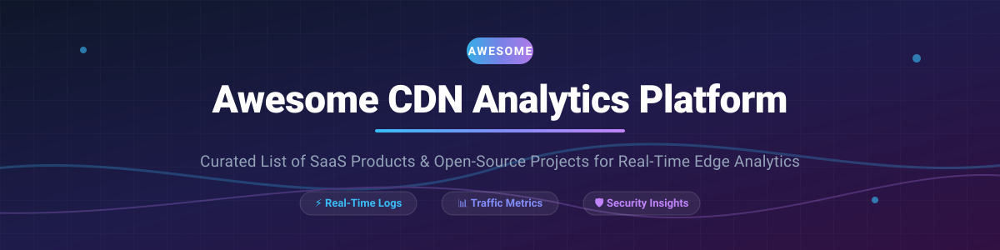

# 🚀 Awesome CDN Analytics Platform

  
  
  
  

## 🌐 Top CDN Analytics Platforms & Open-Source Observability Ecosystem

> **A curated list of SaaS products, cloud tools, and open-source GitHub projects focused on real-time traffic analysis, cache hit performance, security insights, WAF threat monitoring, and edge log management for Content Delivery Networks.**
> 
> *Last updated: September 2026*

---

## 📌 Overview & SEO Keywords

Content Delivery Network (CDN) analytics platforms help developers, SREs, platform engineers, and security operations teams monitor edge server health, cache hit ratio (CHR), origin server latency, bandwidth usage, distributed denial-of-service (DDoS) threats, and Web Application Firewall (WAF) logs.

Whether you rely on enterprise managed CDN solutions or self-hostable log aggregation pipelines (ELK/OpenSearch/Loki), this directory compiles the industry-leading solutions for edge traffic visibility.

---

## 📋 Table of Contents

- [☁️ SaaS / Hosted Platforms](#-saas--hosted-platforms)
- [⚡ Open-Source GitHub Projects](#-open-source-github-projects)
- [🤝 How to Contribute](#-how-to-contribute)
- [💖 Support](#-support)
- [📈 Star History](#-star-history)
- [⚠️ Disclaimer](#%EF%B8%8F-disclaimer)

---

## ☁️ SaaS / Hosted Platforms

The global Content Delivery Network (CDN) market size is estimated at **$28.5 Billion – $38.8 Billion in 2026** (projected to reach >$160 Billion by 2035). The sector is **highly concentrated** among top cloud hyperscalers and edge specialized platforms (a winner-take-most dynamic), where scale, global Point of Presence (PoP) footprint, and deep edge security integration dictate market leadership.

### 📊 SaaS Platform Comparison Matrix

*Note: Companies are sorted by Revenue / Market Capitalization / Valuation in descending order.*

| Platform | Company Size (Revenue / Valuation) 💰 | Starting Price 🏷️ | Free Tier / Trial Limits 🎁 | Key Features & Observability Highlights 🌟 |
| :--- | :--- | :--- | :--- | :--- |
| **[Amazon CloudFront Reports](https://aws.amazon.com/cloudfront/)** | **~$600B+** (AWS Annualized Revenue) | $0.085 per GB (US/Europe egress) | **Always Free**: 1 TB data transfer/mo, 10M HTTP/HTTPS requests/mo, 2M CloudFront Function invocations/mo. | Standard & real-time logs via Kinesis Data Streams; built-in usage/cache reports; CloudWatch edge metrics & alarms. ⚡ |
| **[Google Cloud CDN Insights](https://cloud.google.com/cdn)** | **~$350B+** (Alphabet Cloud Annualized Revenue) | $0.08 per GB (US/Europe egress) | **Free Trial**: $300 credit for 90 days across GCP services (No permanent free CDN tier). | Zero-config Cloud Monitoring dashboards; cache egress, 4xx/5xx error tracking, latency P95 metrics, & client geo-maps. 🔍 |
| **[Cloudflare Analytics](https://www.cloudflare.com/analytics/)** | **~$22B** Market Cap / ~$1.6B Revenue | $25/mo (Pro tier) | **Always Free**: Unlimited cached bandwidth, Zone/Web Analytics, 100k Workers requests/day. | Zone & Account-level analytics, GraphQL API, WAF/DDoS threat visibility, real-time log streaming (Enterprise). 🛡️ |
| **[Akamai Cloud Monitor](https://www.akamai.com/)** | **~$15B** Market Cap / ~$3.8B Revenue | ~$2,000/mo (Enterprise minimum commit) | **No Free Tier**: Custom enterprise POC upon request only. | Real-time push API service streaming transactional & WAF event logs to SIEMs (Mezmo, Splunk, Datadog). 🏢 |
| **[Imperva CDN Analytics](https://www.imperva.com/)** | **$3.6B** (Acquired by Thales) / ~$500M Revenue | ~$500/mo (Enterprise Tier) | **Free Trial**: 14-day free trial with WAF & security dashboard evaluation. | Real-time DDoS & L3/4/7 threat analytics, bot session detection, WAF rule effectiveness, and origin offload stats. 🔐 |
| **[Fastly Real-Time Analytics](https://www.fastly.com/products/observe)** | **~$1.2B** Market Cap / ~$500M Revenue | $50/mo minimum usage charge | **Free Trial**: $50 one-time usage credit for testing (No permanent free tier). | 200+ edge performance metrics, real-time log streaming to 33+ destinations, Origin & Domain Inspector, Log Explorer. 🚀 |
| **[CDN77 Analytics](https://www.cdn77.com/)** | **~$1.9B** Valuation / ~$270M Revenue | $990/mo (Growth tier including 250 TB) | **Free Trial**: 14-day free trial with 50 GB bandwidth test allowance. | Granular API statistics, cache hit/miss ratio, regional bandwidth breakdown, cost monitoring, and 5-minute metric aggregation. 📈 |
| **[Gcore Analytics](https://gcore.com/)** | **~$140M** Revenue (Private) | $35/mo (Start plan) | **Always Free**: 1 TB monthly bandwidth + 1B request allowance. | Real-time traffic analysis, video streaming analytics, raw log export, and edge security monitoring. 🛰️ |
| **[Bunny.net Analytics](https://bunny.net/)** | **~$12.6M** Revenue (Private) | $0.01 per GB ($1/mo minimum commitment) | **Free Trial**: 14-day free trial with 1 TB bandwidth credit. | Transparent PAYG pricing, real-time video heatmap engagement analytics, Country/Datacenter traffic distribution, API metrics. 🐰 |

---

## ⚡ Open-Source GitHub Projects

The open-source ecosystem shines at **log processing, self-hosted web analytics, and full-text log aggregation layers**. While self-hosted open-source software cannot replace a global edge network, these tools allow companies to ingest, parse, search, and visualize CDN log exports (Logpush, S3, Syslog) cost-effectively.

*Note: Projects are sorted by GitHub Star Count in descending order.*

### 🛠️ Open-Source Observability & Log Analytics Repositories

- **[Umami](https://github.com/umami-software/umami/stargazers)**  🌟 `~39,000+ stars`
  - **License:** MIT
  - **Category:** Privacy-First Web Analytics
  - **Description:** Self-hosted, lightweight web analytics solution. Emphasizes privacy and simplicity, collecting essential metrics in a clean dashboard without cookies or tracking personal data. 📊

- **[Plausible Analytics](https://github.com/plausible/analytics/stargazers)**  🌟 `~29,200+ stars`
  - **License:** AGPL-3.0
  - **Category:** Privacy-First Web Analytics
  - **Description:** Simple, lightweight (<1 KB script), cookieless, GDPR-compliant web analytics alternative to Google Analytics. Features real-time dashboards, custom event tracking, and map visualizations. 🔒

- **[Vector](https://github.com/vectordotdev/vector/stargazers)**  🌟 `~22,600+ stars`
  - **License:** MPL-2.0
  - **Category:** High-Performance Log & Metrics Pipeline
  - **Description:** Ultra-fast, memory-efficient observability data pipeline built in Rust. Collects, transforms, and routes massive volumes of CDN logs to multiple backends (ClickHouse, OpenSearch, S3, Kafka). 🦀

- **[GoAccess](https://github.com/allinurl/goaccess/stargazers)**  🌟 `~21,000+ stars`
  - **License:** MIT
  - **Category:** Real-Time Web Server Log Analyzer
  - **Description:** Zero-configuration real-time log analyzer for terminal and browser. Fast C implementation processing millions of HTTP log lines in seconds with micro RAM footprint (~10 MB). ⚡

- **[Grafana Loki](https://github.com/grafana/loki/stargazers)**  🌟 `~20,000+ stars`
  - **License:** AGPL-3.0
  - **Category:** Label-Indexed Log Aggregation Engine
  - **Description:** Horizontally scalable, highly available log aggregation system inspired by Prometheus. Indexes labels rather than text content for extreme storage cost efficiency. 📉

- **[OpenSearch](https://github.com/opensearch-project/OpenSearch/stargazers)**  🌟 `~13,800+ stars`
  - **License:** Apache-2.0
  - **Category:** Distributed Search & Log Analytics
  - **Description:** Community-driven, open-source search and analytics suite forked from Elasticsearch. Paired with OpenSearch Dashboards for deep ELK-style log exploration and alert management. 🔎

- **[Fluentd](https://github.com/fluent/fluentd/stargazers)**  🌟 `~13,600+ stars`
  - **License:** Apache-2.0
  - **Category:** Unified Logging & Data Collector
  - **Description:** CNCF graduated log collector that unifies data collection and downstream routing. Filters, buffers, and routes edge CDN log streams seamlessly. 🔄

- **[Matomo](https://github.com/matomo-org/matomo/stargazers)**  🌟 `~10,000+ stars`
  - **License:** GPL-3.0
  - **Category:** Enterprise Self-Hosted Web Analytics
  - **Description:** Most mature open-source Google Analytics replacement. Full privacy control, detailed visitor insights, custom reports, heatmaps, and funnel analytics. 🧠

- **[Graylog](https://github.com/Graylog2/graylog2-server/stargazers)**  🌟 `~8,100+ stars`
  - **License:** SSPL / Open Source
  - **Category:** Log Management & SIEM
  - **Description:** Centralized log management platform with fast full-text search, live log processing pipelines, parsing rules, stream routing, and enterprise security alerts. 🖥️

- **[GoatCounter](https://github.com/arp242/goatcounter/stargazers)**  🌟 `~5,800+ stars`
  - **License:** EUPL-1.2
  - **Category:** Simple Web Analytics
  - **Description:** Easy self-hosted web analytics without tracking personal data. Can be run as a single static binary or lightweight hosted service. 🐐

- **[Syslog-ng](https://github.com/syslog-ng/syslog-ng/stargazers)**  🌟 `~2,400+ stars`
  - **License:** GPL-2.0 / LGPL-2.1
  - **Category:** High-Throughput Log Transport
  - **Description:** Enterprise log collector capable of structured log processing, TLS encryption, and high-speed syslog routing into analytics databases. 📜

---

## 🤝 How to Contribute

Contributions are warmly welcome! Please follow these simple guidelines:

1. 🍴 Fork this repository.
2. 📝 Add your entry to `README.md` in the relevant section (ensure correct sorting).
3. 🔗 Provide complete URLs, pricing context, free tier details, and factual descriptions.
4. 🚀 Submit a Pull Request with a clear title and description.

If you find this repository helpful, please ⭐ **Star** the repo!

---

## 💖 Support

Thank you for exploring the CDN Analytics ecosystem! Building and maintaining open-source lists takes continuous research and updating.

If this project has saved you time or aided your stack evaluation:
- ⭐ **Star** this repository to increase visibility.
- 🔀 **Fork** and share with fellow SREs, DevOps engineers, and system architects.
- ☕ **Buy me a coffee / Sponsor**: Show your support via the [GitHub Sponsor Dashboard](https://github.com/sponsors/ishandutta2007)!

---

## 📈 Star History

---

## ⚠️ Disclaimer

- This repository contains a community-curated collection of tools and platforms for informational purposes only.
- Company valuations, revenue estimates, and product pricing are based on public disclosures as of late 2026 and may change over time.
- Open-source solutions require infrastructure setup to ingest CDN Logpush / S3 exports to match edge-native proprietary visibility.

---

 Made with ❤️ for SREs, Platform Engineers, &amp; Web Performance Teams worldwide. 

